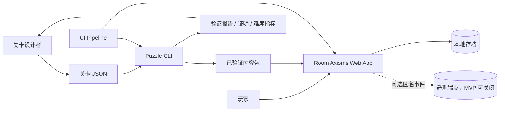
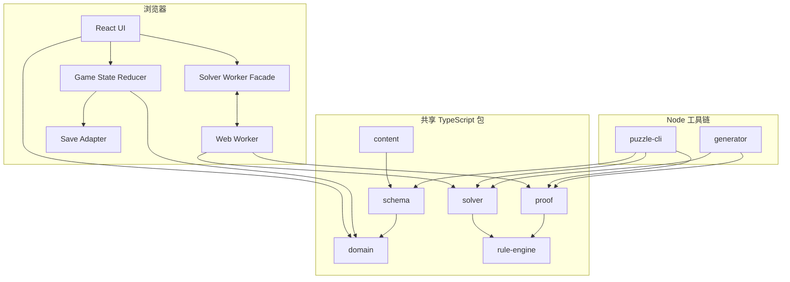
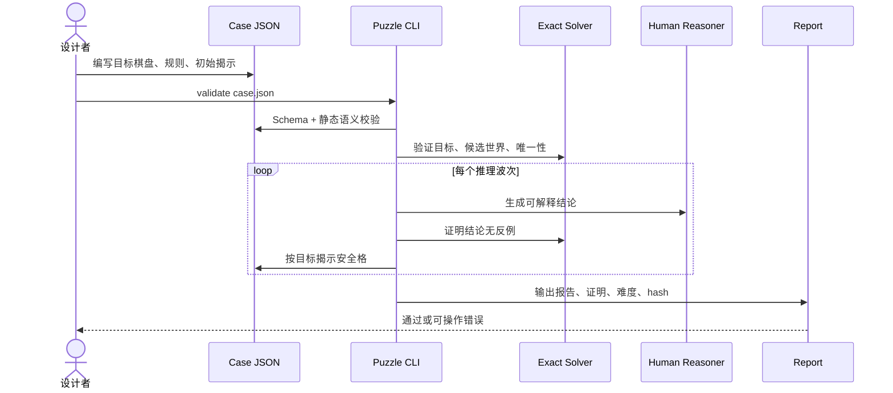
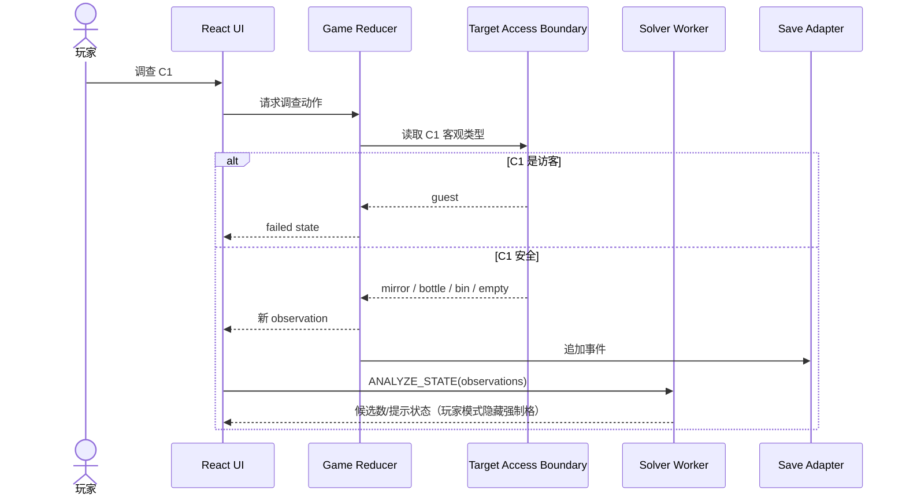
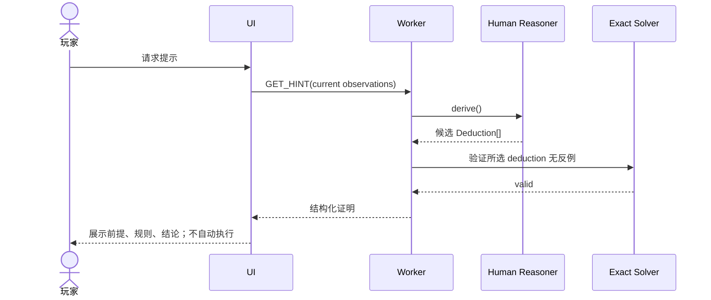
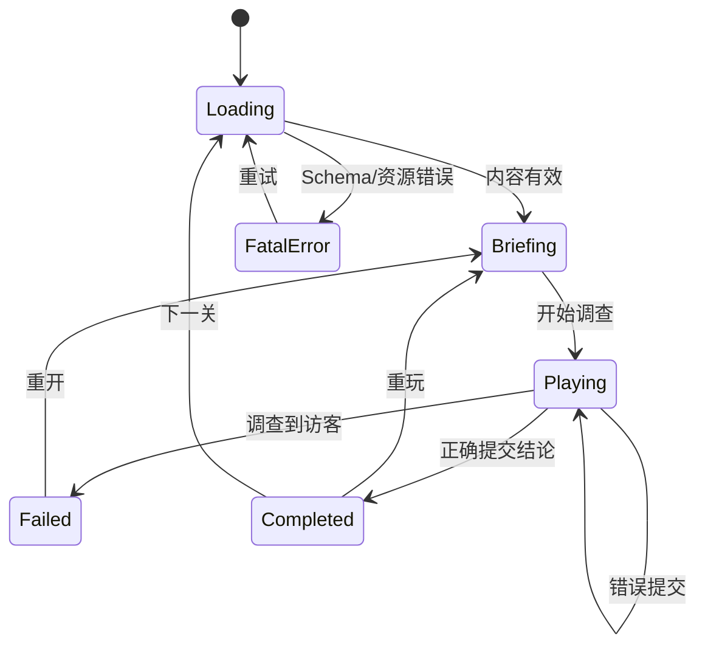
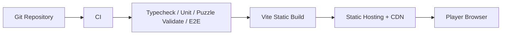

# 《房间公理》架构文档

**版本：** 0.1  
**范围：** 浏览器 MVP、离线关卡工具链、求解与验证架构

---

## 1. 架构驱动因素

按优先级排序：

1. 逻辑正确性与可验证性；
2. 人类可解释的推理；
3. 规则、求解、UI 和内容之间的单一语义来源；
4. 浏览器交互不被求解阻塞；
5. 数据驱动、可批量验证的关卡生产；
6. 可访问、可自动测试的 DOM UI；
7. MVP 低运维成本。

---

## 2. 系统上下文



MVP 没有业务后端。玩家、内容和求解均可离线运行。

---

## 3. 容器视图



---

## 4. 组件职责

### 4.1 `domain`

负责：

- 不可变领域类型；
- 坐标和棋盘函数；
- 游戏事件与 reducer；
- 公共错误码；
- 与框架无关的选择器。

不负责：JSON 校验、搜索、React、持久化、文案。

### 4.2 `schema`

负责：

- Zod 关卡 Schema；
- 版本迁移；
- 静态语义校验；
- 公共/目标 payload 拆分；
- 内容 hash。

### 4.3 `rule-engine`

负责：

- 邻域计算；
- 规则编译为约束；
- 在完整模型上检查规则；
- 规则显示所需的结构化机械描述。

它是 UI 术语和求解语义之间的桥梁，但不返回 React 元素。

### 4.4 `solver`

负责：

- 有限域变量和 constraint propagation；
- 搜索、回溯、assumption；
- 找模型、强制格、唯一性、候选计数；
- 预算、取消、统计。

不负责：中文解释、玩家标记、目标棋盘揭示。

### 4.5 `proof`

负责：

- 人类可读推理技巧；
- 证明 DAG；
- 提示选择；
- 与 exact solver 交叉验证的接口。

不允许读取精确求解器的搜索树后直接说“穷举可得”。

### 4.6 `generator`

负责：

- 目标模型生成；
- 初始揭示选择；
- 零猜测模拟；
- 冗余线索删除；
- 难度和相似度评分。

### 4.7 `apps/web`

负责：

- 页面与组件；
- 输入映射；
- Worker 生命周期；
- 存档；
- 玩家模式/开发者模式；
- 结果与提示展示。

---

## 5. 关键数据流

### 5.1 关卡构建流



### 5.2 玩家调查流



### 5.3 提示流



---

## 6. 运行时状态机



规则在 `Briefing` 前已经加载完成；进入 `Playing` 后不可变。

---

## 7. 知识状态与世界状态隔离

这是最重要的安全边界之一。

### 7.1 世界状态

- 完整目标棋盘；
- 固定规则；
- 内容 hash。

### 7.2 玩家知识状态

- 初始与后续 observations；
- marks；
- 已打开规则帮助；
- hints；
- 事件日志。

### 7.3 约束

- UI 只根据知识状态渲染；
- 目标棋盘仅在调查结算和提交检查时通过窄接口访问；
- exact solver 分析玩家知识时不得自动加入未揭示目标事实；
- 验证器可以访问目标棋盘，用于模拟安全揭示；
- 开发者模式访问目标必须显式开启并带醒目警告。

推荐接口：

```ts
interface TargetResolver {
  inspect(cellId: CellId): CellKind;
  checkGuestMarks(cells: readonly CellId[]): boolean;
}
```

不要向普通 UI 暴露 `getFullTarget()`。

---

## 8. Solver Adapter 边界

为了将来自研 CSP 替换为 SAT/SMT/WASM，定义稳定接口：

```ts
interface SolverBackend {
  compile(puzzle: PublicPuzzle): CompiledPuzzle;
  analyze(
    compiled: CompiledPuzzle,
    observations: readonly Observation[],
    options?: AnalyzeOptions,
  ): Promise<StateAnalysis>;
}
```

`StateAnalysis` 只包含领域结果，不暴露后端变量编号：

```ts
interface StateAnalysis {
  readonly satisfiable: boolean;
  readonly forcedSafe: readonly CellId[];
  readonly forcedGuests: readonly CellId[];
  readonly guestLayoutUnique: boolean;
  readonly candidateGuestLayouts: number | { readonly greaterThan: number };
  readonly stats: SolverStats;
}
```

---

## 9. 关卡内容架构

### 9.1 构建时内容

```text
content/source/*.json
   ↓ schema + full validator
content/generated/index.json
content/generated/reports/*.json
   ↓ Vite import
web bundle
```

### 9.2 公共与解答拆分

```text
case-004.public.json
- id / title / board / rules / initial observations / metadata

case-004.solution.json
- target cells / expected proof waves / validation signature
```

在静态单机中这不是反作弊措施，但能防止 UI 误用解答。发布构建可把 solution 以单独 chunk 或压缩二进制加载。

### 9.3 关卡索引

```ts
interface CaseIndexEntry {
  id: string;
  title: string;
  difficulty: 1 | 2 | 3 | 4 | 5;
  board: BoardSize;
  guestCount: number;
  requiredTechniques: TechniqueId[];
  contentHash: string;
}
```

---

## 10. 存档架构

使用 Repository 接口隔离浏览器存储：

```ts
interface SaveRepository {
  load(puzzleId: string): Promise<SaveRecord | null>;
  put(record: SaveRecord): Promise<void>;
  delete(puzzleId: string): Promise<void>;
  listProgress(): Promise<ProgressSummary[]>;
}
```

实现：

- `IndexedDbSaveRepository`：生产；
- `MemorySaveRepository`：测试/Storybook 类场景；
- `NoopSaveRepository`：嵌入式试玩。

事件日志重放产生当前状态；可定期保存快照以减少重放，但 MVP 数据很小，无需优化。

---

## 11. 部署架构



部署要求：

- HTTPS；
- immutable hash assets；
- `index.html` 短缓存；
- CSP 禁止内联脚本（原型除外，正式版使用模块文件）；
- source maps 仅按发布策略上传/开放；
- 无服务端会话。

---

## 12. 可观测性

MVP 以本地开发诊断为主。

### 12.1 Solver stats

```ts
interface SolverStats {
  elapsedMs: number;
  nodesVisited: number;
  propagations: number;
  backtracks: number;
  cacheHits: number;
  timedOut: boolean;
}
```

### 12.2 状态 hash

每次分析记录：

- puzzle content hash；
- observations hash；
- solver version；
- stats；
- result summary。

发生错误时能生成可复制命令：

```bash
pnpm puzzle solve case-004.json --observations B1=bottle,A2=bottle,C2=bottle,C1=mirror
```

---

## 13. 架构决策记录（ADR）

### ADR-001：浏览器优先静态应用

**决定：** React/Vite 静态站点，无业务后端。  
**原因：** 核心玩法与求解可离线；减少运维和网络不确定性。  
**后果：** 暂无跨设备云存档；静态资源中理论上可找到解答。

### ADR-002：规则 DSL 数据化，禁止可执行规则

**决定：** 只允许版本化联合类型规则。  
**原因：** 可审计、可迁移、可由多组件共同解释。  
**后果：** 新规则类型需要代码与 Schema 升级，不能由内容作者任意脚本扩展。

### ADR-003：精确求解器与人类推理器分离

**决定：** 两个引擎各自实现，不把搜索树包装成提示。  
**原因：** 数学正确与人类可理解是不同质量维度。  
**后果：** 开发成本增加，但能系统发现解释缺口。

### ADR-004：自研有限域 CSP 作为 MVP 后端

**决定：** 使用 TypeScript bitmask + propagation + DFS。  
**原因：** 规模小、依赖少、易调试、能共享浏览器与 Node。  
**后果：** 后期复杂规则可能需要 SAT/SMT；因此保留 Solver Adapter。

### ADR-005：求解运行在 Web Worker

**决定：** 浏览器分析放入 Worker。  
**原因：** 即使平均很快，最坏搜索也不应冻结输入。  
**后果：** 需要序列化协议、取消和陈旧响应处理。

### ADR-006：游戏会话事件化

**决定：** 玩家动作作为事件，经纯 reducer 生成状态。  
**原因：** 易测试、重放、存档、分析和复现 bug。  
**后果：** 需维护事件/存档版本迁移。

### ADR-007：最终唯一性只要求访客布局

**决定：** 不要求所有安全物件在候选世界中唯一。  
**原因：** 玩家目标是危险位置，要求完整陈设唯一会产生不必要线索。  
**后果：** 唯一性检查必须比较 guest bitset，而不是完整模型。

---

## 14. 扩展点

未来规则类型必须满足：

1. 有精确定义；
2. 有 UI 范围表示；
3. 能编译到 exact solver；
4. 至少有一个人类推理模板；
5. 有边界与反例测试；
6. 不破坏知识单调性。

候选扩展：

- 同行/同列计数；
- 曼哈顿距离；
- 最近目标；
- 有限视线与遮挡；
- 两类危险实体；
- 固定地形；
- 多房间但每房间规则完整公开。

动态新增规则不属于该架构的自然扩展，需另立产品与知识模型。

---

## 15. 架构验收

- [ ] `domain` 可在 Node 与浏览器无条件运行。
- [ ] UI、solver、proof 使用同一 `RuleDefinition`。
- [ ] 目标棋盘不会进入普通 UI selector。
- [ ] Worker 响应按状态版本丢弃过期结果。
- [ ] exact solver 和 human reasoner 可独立测试。
- [ ] CLI 与浏览器对同一状态给出相同 exact 结果。
- [ ] 所有关卡在 CI 中完整验证。
- [ ] 规则新增需通过 exhaustiveness 编译错误暴露遗漏。
- [ ] 持久化可通过事件重放恢复。
- [ ] 无后端时主流程可离线完成。
